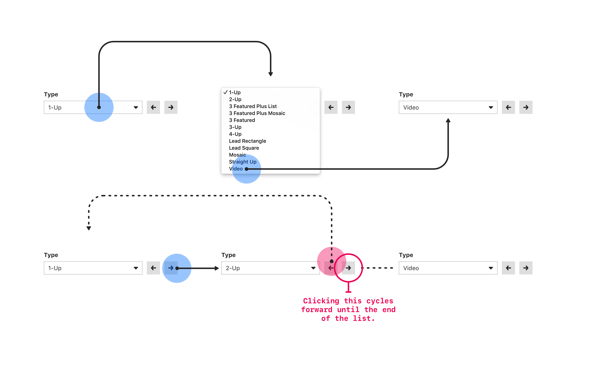

# NBC News Dropdown Control
React Coding Challenge for Front End Developers

## Instructions
You will be creating a custom dropdown component that selects content package types. Given this application framework, please complete the following [workflow](#workflow).

### TODO A
- [ ] The dropdown does not have any options loaded. Use the data array given in `DropdownControl.js` component state to render options values.
- [ ] Use the `label` parameter for user display and `name` for a unique value identifier.

### TODO B
- [ ] There should be two arrow buttons next to the dropdown that update the current value.
- [ ] The left arrow should move back which option is selected, and the right arrow should move it forward.

## Installation and Startup

This project is based off of [create-react-app](https://github.com/facebook/create-react-app) for setup simplicity.

```bash
$ npm install
$ npm start     # Start the development server
```

## Project Structure

```
.
├── public                               # Static public assets
│   ├── index.html                       # Main HTML page container for app
├── src                                  # Application source code
│   ├── index.js                         # Mounts React application
│   ├── components                       # Application components
│   │   ├── App                          # Root component
│   │   ├── DropdownControl              # Dropdown component
│   │   │   ├── index.js                 # Index file for better pathing
│   │   │   ├── DropdownControl.js       # Dropdown component file (TODO)
│   │   │   └── DropdownControl.css      # Dropdown component styling
│   │   └── Header                       # Header component
│   └── utils                            # Application utils
└── README.md                            # Application instructions
```

## Workflow


Please don't hesistate to ask if you have any questions. Good luck!
